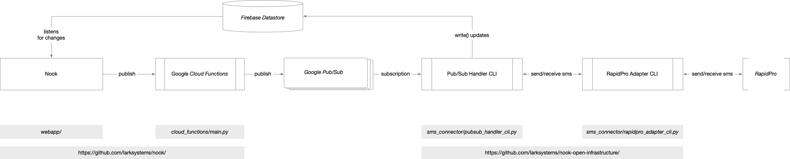

# Systems architecture

This document describes the system architecture for an open source version of Katikati.

A deployment includes a few basic components:

1. [Nook](https://github.com/larksystems/nook) (the browser based UI for having conversations)
2. A Google Cloud / Firebase project for hosting the data storage and inter-service communications infrastructure
3. A communications client (such as [RapidPro](https://app.rapidpro.io/)) for handling the communications to the end-client (sms, IM, etc.)
4. A messaging adapter for connecting to the communications client (in this repository you can find one such [adapter for RapidPro](/sms_connector/rapidpro_adapter_cli.py))
5. A [PubSub handler](/sms_connector/pubsub_handler_cli.py) for connecting Nook and the messaging adapter.

These components can be controlled by command line tools run from a developer's Linux or Mac OS machine.

The setup we recommend for running an open Katikati project is to deploy [Nook](https://github.com/larksystems/nook) to Firebase's hosting infrastructure,
and to run the messaging adapter and the PubSub handler in a Google Cloud Virtual Machine, but they can also be run locally, from a developer's machine.

Below you can find a diagram summarising the components and how they integrate with each other:

The [setup guide](./setup_guide.md) will guide you through all you need to do to have a deployment of the open source version of Katikati.
