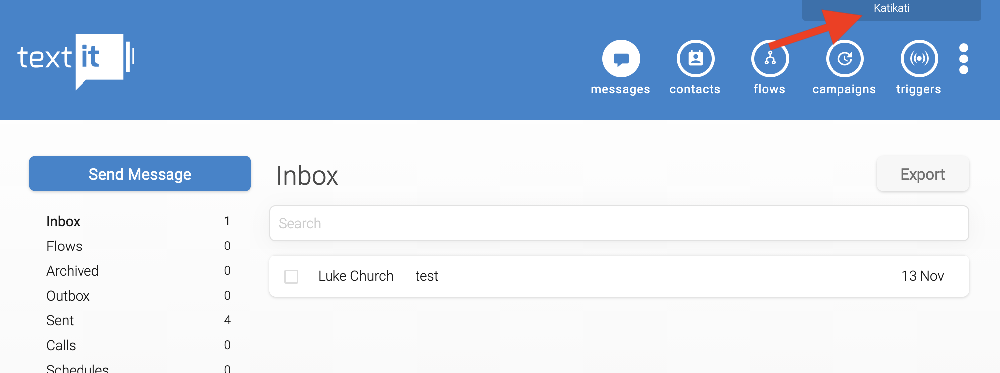
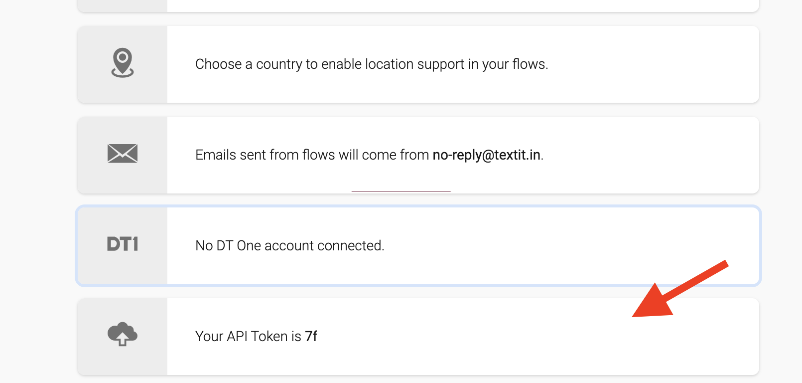

# Setup Guide

## 1. Setup RadidPro API key

1.1. Create a new RapidPro instance (we recomend using TextIt.in)

1.2. Setup the channels that you want to use to send and recieve SMSs

1.3. Locate the API key
- click on the org:



- then about half way down the administrator UI you will fine the API token:



1.4. Make a copy of the [rapidpro_config.json](/setup/rapidpro_config.json) file and replace the API key with the one you've just copied from RapidPro. Keep a note of the path to this json file.

## 2. Setup a Google Cloud project

2.1. Register at cloud.goole.com and enable billing.

2.2. Install the `gcloud` and `gsutil` tools via installing the [Google Cloud SDK](https://cloud.google.com/sdk/docs/install)

2.3. Run the following on a bash-like terminal replacing the text as appropriate to create the authentication setup:

```
export KK_PROJECT="__NAME_OF_YOUR_GCLOUD_PROJECT__"

gsutil -mb -p $KK_PROJECT gs://$KK_PROJECT-rapidpro-credentials
gsutil cp __PATH_TO_THE_CONFIG_FILE__ gs://$KK_PROJECT-rapidpro-credentials
```

where `__PATH_TO_THE_CONFIG_FILE__` is the path to the `rapidpro_config.json` file you copied and edited earlier.

2.4. Create a service account (this will store the crypto token fro the service account in ~/local_crypto_tokens, if you want it to be somewhere else, replace the string below and keep a note of where, you'll need it later)

```
gcloud iam service-accounts create $KK_PROJECT --project=$KK_PROJECT --description="katikati-open service account" --display-name="Katikati Open SA"

mkdir ~/local_crypto_tokens
gcloud iam service-accounts keys create ~/local_crypto_tokens/$KK_PROJECT.json --iam-account $KK_PROJECT@$KK_PROJECT.iam.gserviceaccount.com
```

2.5. Assign rights for the service account

```
gcloud projects add-iam-policy-binding $KK_PROJECT --member="serviceAccount:$KK_PROJECT@$KK_PROJECT.iam.gserviceaccount.com" --role="roles/firebase.admin"
gcloud projects add-iam-policy-binding $KK_PROJECT --member="serviceAccount:$KK_PROJECT@$KK_PROJECT.iam.gserviceaccount.com" --role="roles/pubsub.admin"
```

2.6. Enable APIs for the project

```
gcloud services enable --project $KK_PROJECT pubsub.googleapis.com
gcloud services enable --project $KK_PROJECT cloudbuild.googleapis.com
```


## 3. Setup Firebase project

3.1. Go to `console.firebase.google.com`

3.2. Click "Add project"

3.3. Select the Google Cloud project you created earlier

3.4. Select the 'pay as you go' plan

3.5. Google Analytics is optional for Katikati projects, it's up to you whether to include it or not

3.6. Click 'Add Firebase' and wait for the indicator that Firebase is ready.

3.6. Click on 'Cloud Firestore' > 'Create database' > 'Start in production mode' > set the location to be a 'multi-region' as close to where your users of Nook will be. We typically we use 'eur3 (europe-west)'

3.7. Click 'Enable'


## 4. Sync data from RapidPro -> Firebase

4.1. Make a copy of the [rapidpro_sync_token](/setup/rapidpro_sync_token) file and change the time in the file to the start of the project. Keep a note of the path to this file.

4.2. Navigate to `nook-open-infrastructure/sms_connector`

4.3. run

```
pipenv --three
pipenv update
pipenv shell

python pubsub_handler_cli.py ~/local_crypto_tokens/$KK_PROJECT.json
```

and in another terminal window run

```
pipenv shell
python rapidpro_adapter_cli.py --crypto-token-file ~/local_crypto_tokens/$KK_PROJECT.json --project-name $KK_PROJECT --credentials-bucket-name $KK_PROJECT-rapidpro-credentials --last-update-token-path __PATH_TO_THE_SYNC_TOKEN_FILE__
```

where `__PATH_TO_THE_SYNC_TOKEN_FILE__` is the path to the `rapidpro_sync_token` file you copied and edited earlier.

## 5. Setup Nook deployment configuration

5.1. Clone the Nook repo: https://github.com/larksystems/nook

5.2. Copy the [firebase_constants.json](/setup/firebase_constants.json) file under [nook/webapp/web/assets/](https://github.com/larksystems/nook/tree/master/webapp/web/assets) on your disk

5.3. Log in to https://console.firebase.google.com/

5.4. Add the support email if needed

5.5. Add a web project to the Firebase instance

5.6. Setup authentication to use the Google Authentication provider (Firebase Console -> Authentication - Sign In method - Google - Enable)

5.7. Switch to the config view in the Firebase SDK and copy the listed contents into the file that you cloned in step (5.2). Note that the configuration in firebase needs the key-names double-quoting in order to be valid JSON. Update the three URLs at the end of the `firebase_constants.json` file with the name of your firebase instance instead of "katikati-open".

5.8. Navigate to [nook/tool](https://github.com/larksystems/nook/tree/master/tool)

5.9. Run `./deploy_webapp.sh ../webapp/web/assets/firebase_constants.json ~/local_crypto_tokens/$KK_PROJECT.json`

5.10. Check that Nook is now serving correctly by visiting the line associated with 'authDomain' in the config file. You should be able to log in, however when you do you'll reach a page that says that you don't have permission to access the dataset.

## 6. Initialise Nook

6.1. Add yourself as a user to Nook (TODO: Replace this with the configurator) (Firebase Console -> Firestore -> Add collection (users) -> add document (ID == your email address)

6.2. Setup the shard map for the conversations (Firebase Console -> Firestore -> nook_conversation_shards -> shard-0 -> Add field 'num_shards' : 1 (number)

You should now be able to load Nook and see the conversations!
